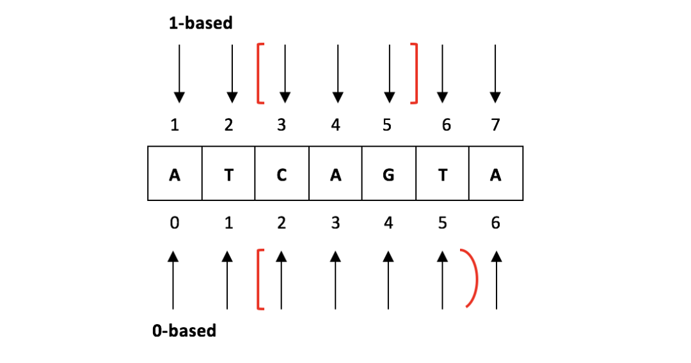
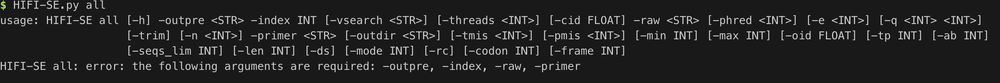
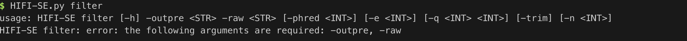
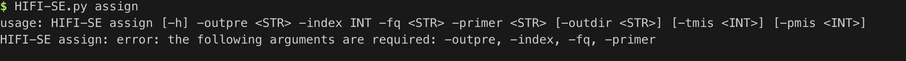
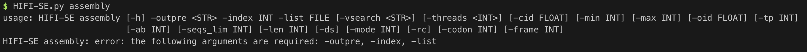

## 主题
主题： 生物信息Python编程介绍
主讲人： 杨琛涛
时间： 2021/08/31

## 准备
- 安装好Python3以及Linux操作环境
- 需要安装如下的包
	- biopython
	- icecream
	- jieba
	- wordcloud


## 思考

- 为什么要编程？
- 生物信息学编程的特点

## 常见编程场景和解决方案

### 格式和输入

#### FASTA, FASTQ

>\>Seqeunce1  
>ATCGGCATGGTATGATGCTAGCTAGTGATCGATCGTAGCTAGTCATG

>@FCD13VUACXX:6:1101:19033:8980#ATCACGAT/2
TAAATAATAAGAGGCAATAACATATAAAAGAATACTGCTTCTCAAAATTGGTCTGAATACTTGTATTTAATAATACTTATCCTGATGTTA
+  
BCCFFFFFHHHHHJJJJJJJJJJJJJJJJJJJJJJJJJJJJJJIIIJIJJIIJJJJJJJJJJJJJJJJIJJGIJJJJJIJJJHHEHHHFF

Q: 相同点和不同点？

Fasta属于由特定分隔符标识的文件类型，Fastq 既属于特定分隔符标识的文件类型，又属于特定行标识的文件类型。


例子1：解析fasta格式

```python
#!/usr/bin/env python3

import sys
from icecream import ic

with open("../data/demo.fasta", 'r') as fh:
    name, seq = None, []
    for line in fh:
        line = line.rstrip()
        if line.startswith(">"):
            if name:
                ic(name, seq)
            name, seq = line, []
        else:
            seq.append(line)
    if name:
        ic(name, seq)
```
```shell
python3 parse_fasta.py
```

Q: 如何使用迭代的思想构造读取fasta的函数？


关于迭代器 (详细内容请移步[yield](https://gitbook.cn/books/5de7ccc93dfde9132ce8c39b/index.html))

- 带yield 的函数是一个迭代器
- 当程序运行到yield的时候会停下来
- 当继续运行，next的时候会从上一次中断的地方开始


总结：
迭代器的好处
- 内存消耗
- 可以将冗长的代码变得清晰，模块化

上面读取fasta的脚本可以写成：

```python
def parse_fasta(fh):
    name, seq = None, []
    for line in fh:
        line = line.rstrip()
        if line.startswith(">"):
            if name:
                yield name, ''.join(seq)
            name, seq = line, []
        else:
            seq.append(line)
    if name:
        yield name, ''.join(seq)


with open("../data/demo.fasta", 'r') as fh:
    for name, seq in parse_fasta(fh):
        ic(name, seq)
```

运行一下
```python3 parse_fasta_generator.py```

例子2： 解析fastq

```python
from icecream import ic

with open("../data/demo_1.fq", 'r') as fh:
    name, seq = None, []
    for line in fh:
        line = line.rstrip()
        if line.startswith("@"):
            if name:
                ic(name)
            name, seq = line, []
        else:
            seq.append(line)
    if name:
        ic(name)
 ```
 
 运行一下
 ```python3 parse_fastq.w.py```
 
 Q: 查看结果有没有问题？
 
 “@”符号既是fastq的标识符，但也会是一个质量值的符号，所以按照“@”符号进行识别是错误的。
 
 Q: "@"对应的质量值是怎么计算的？
 
 ```python
 from icecream import ic

def parse_pe_fastq(fq1, fq2):
    while True:
        name1 = fq1.readline().split(" ")[0].replace("/1", "")
        name2 = fq2.readline().split(" ")[0].replace("/2", "")
        if not name1 or not name2:
            break
        read1, nothing1, qual1 = fq1.readline()[:-1], fq1.readline(), fq1.readline()[:-1]
        read2, nothing2, qual2 = fq2.readline()[:-1], fq2.readline(), fq2.readline()[:-1]
        assert name1 == name2, 'fastq1, fastq2 is not paired-end'
        yield name1, read1, read2, qual1, qual2


if __name__ == '__main__':
    fq1 = open("../data/demo_1.fq", 'r')
    fq2 = open("../data/demo_2.fq", 'r')
    for name, read1, read2, qual1, qual2 in parse_pe_fastq(fq1, fq2):
        ic(name, read1, read2, qual1, qual2)
```

运行一下
```python3 parse_fastq_generator.py```

- 注意对于PE read，检查ID很重要
- assert的用法

E: 自己搜集不同平台下read的格式，包括solexa, Ion-Proton, Illumina hiseq 2000, 4000, x10, bgiseq-500, bigseq-2000, MGISEQ-T1, 


assert的用法


```assert expression```

等价于

```
if not expression:
    raise AssertionError
```

assert 后面也可以紧跟参数:

```assert expression [, arguments]```

等价于

```
if not expression:
    raise AssertionError(arguments)
``` 

例子3： 打开压缩文件

```python
import gzip
with gzip.open("../data/demo_1.fq.gz", 'r') as fq:
    ic(fq)

```

总结：
当你在一个程序中涉及到很多压缩文件，未压缩文件同时要处理的时候，改写一个smart_open 会是最好的选择。


```python
import gzip
from icecream import ic
def smart_open(file, opera):
    if opera == 'r':
        if os.path.exists(file) ==False:
            print("Can not open file {}".format(file))
            exit()
        else:
            if file.endswith(".gz"):
                out = gzip.open(file, 'rt')
            else:
                out = open(file, 'r')
    elif opera == 'w':
        if file.endswith(".gz"):
            out = gzip.open(file, 'wt')
        else:
            out = open(file, 'w')
    return out


with smart_open("../data/demo.fasta", 'r') as fh:
    ic(fh)

with smart_open("../data/demo_1.fq.gz", 'r') as fq:
    ic(fq)
```

运行一下
```python3 smart_open.py```

总结：
上面这个例子告诉我们文件句柄也可以成为返回的对象，以及可以通过操作以后的函数实现更广泛的功能。

Q: 还有什么方法可以改写一个已有的方法（函数）


#### Table format: blast, m8/f6; sam/bam, vcf

分析过程中的bed文件一般代表区域信息，如表示Peak位置的bed文件，表示基因注释的bed12文件。
* 表示基因注释时，gtf/gff和bed文件的区别
1）gtf/gff文件一行表示一个exon/CDS等子区域，多行联合表示一个gene；bed文件一行表示一个gene；
2）gtf文件中碱基位置定位方式是1-based，而bed中碱基定位方式是0-based，如下图所示。


* bed文件每一行对应信息

必须包含的3列信息：
1）chrom：染色体名字 (e.g.chr3, chrY, chr2_random或者scaffold10671)。
2）chromStart：基因在染色体或scaffold上的起始位置（0-based）。
3）chromEnd：基因在染色体或scaffold上的终止位置 （前闭后开）。

可选的9列信息：
4）name：bed文件的行名。
5）score：本条基因在注释数据集文件中的评分（0-1000），在Genome Browser中会根据不同区段的评分显示对应的阴影强度（评分越高灰度越高）。
6）strand：链的方向+、-或. (.表示不确定链的方向)
7）thickStart：CDS区（编码区）的起始位置，即起始密码子的位置。
8）thickEnd：The endingposition at which the feature is drawn thickly (for example the stop codon ingene displays).
9）itemRgb：RGB颜色值（如：255,0,0），方便在GenomeBrowser中查看。
10）blockCount：bed行中外显子的数目。
11）blockSizes：逗号分割的列，数目与blockCount值对应，每个数表示对应外显子的碱基数。
12）blockStarts：逗号分割的列，数目与blockCount值对应，每个数表示对应外显子的起始位置（数值是相对ChromStart计算的）。

```sam```文件全称The SequencingAlignment/Map Format，是Alignment/Map步骤bwa/STAR/HISAT2等软件对结果的标准输出文件，用于存储reads比对到参考基因组的比对结果，是一个纯文本格式，文件一般较大。为了节省硬盘存储，一般使用其高效压缩的二进制格式```bam```文件。
利用samtools view的-b参数就能把```sam```文件转为```bam```文件。
1）sam文件查看方式
在linux终端直接用less即可进行查看；
2）bam文件查看方式
需要借助samtools view工具进行查看
samtools view filename.bam | less -S
samtools view -h filename.bam | less -S
NGS分析中大多数文件都是由header和record两部分组成，加上-h参数后可以将header显示出来，默认是不显示的。

实际工作中很少直接针对这些文件处理，因为要么可以直接用cut, sed, grep, awk, 这些工具操作table文件，或者就是用专门的工具处理，比如samtools, vcftools, bedtools 等。

比较常见的编程场景
- 根据一个List从结果中筛选；
- 对结果重新排序；
- 根据规则挑选满足条件的结果

例子1：处理Blast的结果，选取比对最好的结果

```
#!/usr/bin/evn python3

import sys

if len(sys.argv) < 4:
    print(f"python3 {sys.argv[0]} <blastout> <topmatch|int> <tohit|int> [desc.txt|option]")
    exit()

def parser_blast(file):
    pre = ""
    target_match = []
    with open(file, 'r') as fh:
        while True:
            line = fh.readline().strip()
            if not line:
                break
            tmp = line.strip().split("\t")
            if pre == "":
                target_match = [line,]
                pre = tmp[0]
            elif tmp[0] == pre:
                target_match.append(line)
            else:
                yield target_match
                target_match = [line,]
                pre = tmp[0]
        yield target_match


def getinfo(desc):
    info = {}
    with open(desc, 'r') as fh:
        for i in fh:
            if i.startswith("#"):continue
            tmp = i.strip().split()
            info[tmp[0]] = " ".join(tmp[1:])
    return info


def main():
    match_lim = int(sys.argv[2])
    hit_lim = int(sys.argv[3])
    if len(sys.argv) > 4:
        descs = getinfo(sys.argv[4])

    for arr in parser_blast(sys.argv[1]):
       # print(len(arr))
        match = 0
        hit = {}
        pre = " "
        output = []
        for line in arr:
            tmp = line.split("\t")
            querry = tmp[1]
            if len(sys.argv) > 4:
                if querry in descs:
                    info = descs[querry]
                    tmp.append(info)
                else:
                    tmp.append("-")
            if pre == " ":
                match = 1
                pre = querry
                hit[pre] = 1
                output.append("\t".join(tmp))
            elif querry == pre and hit[querry] >= hit_lim:
                continue
            elif querry == pre:
                hit[querry] += 1
                output.append("\t".join(tmp))
            elif match >= match_lim:
                break
            else:
                match += 1
                pre = querry
                hit[pre] = 1
                output.append("\t".join(tmp))

        print("\n".join(output))

if __name__ == "__main__":
    main()
```

运行一下
```python3 select_topN_blast.py ../data/demo.blast 1 1 ```

- 利用yield生成迭代器，每次返回一个含有相同querry名称的块
- 块状文件按顺序读取是的方法


例子2：文件排序，blast 结果按照identity排序

```python
#!/usr/bin/evn python3

import sys
from icecream import ic
if len(sys.argv) < 2:
    print(f"python3 {sys.argv[0]} <blastout>")
    exit()

def addtodict2(thedict,key_a,key_b,val):
    if key_a in thedict:
        thedict[key_a].update({key_b:val})
    else:
        thedict.update({key_a:{key_b:val}})


def parser_blast(file):
    pre = ""
    target_match = {}
    with open(file, 'r') as fh:
        while True:
            line = fh.readline().strip()
            if not line:
                break
            tmp = line.strip().split("\t")
            identity, score = float(tmp[2]), float(tmp[-1])
            if pre == "":
                target_match[line]= identity
                pre = tmp[0]
            elif tmp[0] == pre:
                target_match[line]= identity
            else:
                yield target_match
                target_match = {}
                target_match[line]= identity
                pre = tmp[0]
        yield target_match


def main():

    for arr in parser_blast(sys.argv[1]):
        b = sorted(arr.items(), key=lambda x: x[1], reverse=True)
        ic(b)

if __name__ == "__main__":
    main()
```

运行一下
```python3 sort_blast_identity_score.py```

#### GFF, GTF

```text
Scaffold1	GeMoMa	mRNA	91540	92049	.	+	.	ID=Mcap_g00001_i1
Scaffold1	GeMoMa	CDS	91540	92049	.	+	0	Parent=Mcap_g00001_i1
Scaffold1	GeMoMa	mRNA	93616	94830	.	-	.	ID=Mcap_g00002_i1
Scaffold1	GeMoMa	CDS	93616	94425	.	-	0	Parent=Mcap_g00002_i1
Scaffold1	GeMoMa	CDS	94654	94830	.	-	0	Parent=Mcap_g00002_i1
Scaffold1	GeMoMa	mRNA	94884	95726	.	-	.	ID=Mcap_g00003_i1
Scaffold1	GeMoMa	CDS	94884	95726	.	-	0	Parent=Mcap_g00003_i1
Scaffold1	GeMoMa	mRNA	101447	103931	.	+	.	ID=Mcap_g00004_i1
Scaffold1	GeMoMa	CDS	101447	101627	.	+	0	Parent=Mcap_g00004_i1
Scaffold1	GeMoMa	CDS	101760	101917	.	+	2	Parent=Mcap_g00004_i1

```

#### 标准工具

不用重新造轮子
- biopython
- pysam
- ete3


### 信息提取和处理， 统计，比较，计算

例子1：统计序列长度，上分位，下分位，平均值，GC含量，N50

E: 完成一个脚本，可以处理以下所以内容

```text
usage: fastaKit [-h] [-n <STR>] [-ex <STR>] [-rg <STR>] [-nl FILE] [-exl FILE] [-rgl FILE] [-ap <STR>] [-pos <INT>] [-lgt <INT>] [-lle <INT>] [-a2u] [-rw]
                [-tr] [-codon CODON] [-cutf <INT>] [-cuts <INT>] [-o <STR>] [-z] [-sta]
                <File>

Description

    Fasta Kit for dealing with fasta file, including name modification,
    filtering sequences by length, format changes, subfiles retrevied, etc.
    I include all kinds of tools as possible as I can.

Usage
    # select sequences which contain 'HOMO' in ID
    python3 fastaKit  -n HOMO -o output.fa test.fa
    # add a name 'prefix' to name ID for each sequence
    python3 fastaKit  -ap HOMO -o output.fa test.fa
    # filtering sequence by length (>= 100bp)
    python3 fastaKit  -lgt 100 -o output.fa test.fa
    # filtering sequence by length (>= 100 and <= 150)
    python3 fastaKit  -lgt 100 -lle 150 -o output.fa test.fa
    # aligned sequence to unaligned
    python3 fastaKit  -a2u  -o output.fa test.fa
    # cut sequence into [INT] files
    python3 fastaKit  -cutf 10 -o outdir test.fa

positional arguments:
  <File>        input fasta file

optional arguments:
  -h, --help    show this help message and exit
  -n <STR>      target ID exactally
  -ex <STR>     excluded name
  -rg <STR>     target regx word to find sequences
  -nl FILE      selecting sequences by a ID list
  -exl FILE     selecting sequences by an excluding list
  -rgl FILE     selecting sequences by a regular expression list
  -ap <STR>     add a specific prefix to ID
  -pos <INT>    position of tag you added
  -lgt <INT>    deal with by length, select sequences by larger than [INT] bp
  -lle <INT>    deal with by length, select sequences by smaller than [INT] bp
  -a2u          change format, aligned sequence to unaligned
  -rw           change format, multi-line to single line
  -tr           translate fasta into protein (CDS only)
  -codon CODON  codon table usage (CDS only, with -tr)
  -cutf <INT>   cut fasta into files by file number
  -cuts <INT>   cut fasta into files by specific sequence number
  -o <STR>      output file or outdir for -cutf/-cuts
  -z            output a gzip type file
  -sta          basic statistic of fasta
```

参考脚本：
```python3 fastaKit```

argparse 包

1. argparse介绍

是python的一个命令行解析包，非常编写可读性非常好的程序

2. 基本用法

```python
import argparse
parser = argparse.ArgumentParser()
parser.parse_args()
```

```shell
python prog.py 
python prog.py --help
python prog.py -v 
python prog.py foo
```

3. positional arguments

```python
import argparse
parser = argparse.ArgumentParser()
parser.add_argument("echo")
args = parser.parse_args()
print args.echo
```

```shell
python prog.py   
python prog.py -h
python prog.py hahahaha
```

4. optional arguments

```python
import argparse
parser = argparse.ArgumentParser()
parser.add_argument("-v", "--verbosity", help="increase output verbosity")
args = parser.parse_args()
if args.verbosity:
        print "verbosity turned on"
```

```shell
python prog.py -v 1
python prog.py --verbosity 1
python prog.py -h
python prog.py -v 
```

5. action='store_true'

```python
import argparse
parser = argparse.ArgumentParser()
parser.add_argument("-v", "--verbose", help="increase output verbosity",
                    action="store_true")
args = parser.parse_args()
if args.verbose:
        print "verbosity turned on"
```

```shell
python prog.py -v
python prog.py -h
```
6. 类型 type
```python
import argparse
parser = argparse.ArgumentParser()
parser.add_argument('x', type=int, help="the base")
args = parser.parse_args()
answer = args.x ** 2
print answer
```

```shell
python prog.py 2
python prog.py two
python prog.py -h 
```

7. 可选值choices=[]

```python
import argparse
parser = argparse.ArgumentParser()
parser.add_argument("square", type=int,
                    help="display a square of a given number")
parser.add_argument("-v", "--verbosity", type=int, choices=[0, 1, 2],
                    help="increase output verbosity")
args = parser.parse_args()
answer = args.square**2
if args.verbosity == 2:
    print "the square of {} equals {}".format(args.square, answer)
elif args.verbosity == 1:
    print "{}^2 == {}".format(args.square, answer)
else:
    print answer
```

```shell
python prog.py 4 -v 0
python prog.py 4 -v 1
python prog.py 4 -v 2
python prog.py 4 -v 3
python prog.py -h
```

8. 自定义帮助信息help
9. 程序用法帮助

```python
import argparse
parser = argparse.ArgumentParser(description="calculate X to the power of Y")
group = parser.add_mutually_exclusive_group()
group.add_argument("-v", "--verbose", action="store_true")
group.add_argument("-q", "--quiet", action="store_true")
parser.add_argument("x", type=int, help="the base")
parser.add_argument("y", type=int, help="the exponent")
args = parser.parse_args()
answer = args.x**args.y

if args.quiet:
    print answer
elif args.verbose:
    print "{} to the power {} equals {}".format(args.x, args.y, answer)
else:
    print "{}^{} == {}".format(args.x, args.y, answer)
```

```shell
python prog.py -h
```
10. 互斥参数

```python
group = parser.add_mutually_exclusive_group()
group.add_argument("-v", "--verbose", action="store_true")
group.add_argument("-q", "--quiet", action="store_true")
```

```shell
python prog.py 4 2
python prog.py 4 2 -v
python prog.py 4 2 -q
python prog.py 4 2 -q -v
```
Q: 还有什么方式可以实现这种互斥？


11. 参数默认值

```python
import argparse
parser = argparse.ArgumentParser(description="calculate X to the power of Y")
parser.add_argument("square", type=int,
                    help="display a square of a given number")
parser.add_argument("-v", "--verbosity", type=int, choices=[0, 1, 2], default=1,
                    help="increase output verbosity")
args = parser.parse_args()
answer = args.square**2
if args.verbosity == 2:
    print "the square of {} equals {}".format(args.square, answer)
elif args.verbosity == 1:
    print "{}^2 == {}".format(args.square, answer)
else:
    print answer
```

```shell
python prog.py 8 
python prog.py 8 -v 0
python prog.py 8 -v 1
python prog.py 8 -v 2
```

12. 参数组

```python3 HIFI-SE.py```

```text
positional arguments:
  {all,filter,assign,assembly,polish,taxonomy}
    all                 run filter, assign and assembly.
    filter              remove or trim reads with low quality.
    assign              assign reads to samples by tags.
    assembly            do assembly from assigned reads,
                        output raw HIFI barcodes.
    polish              polish COI barcode assemblies,
                        output confident barcodes.
    taxonomy            do taxa identification on BOLD system

optional arguments:
  -h, --help            show this help message and exit
  -v, --version         show program's version number and exit
```

```python3 HIFI-SE.py all```

```python3 HIFI-SE.py filter```

```python3 HIFI-SE.py assign```

```python3 HIFI-SE.py assembly```



反向互补序列

用三种方法分布实现反向互补序列
- replace()
- dictionary
- transtable()

```python
import time

def revcom_base(sequence):
    # make a sequence complement #
    sequence = sequence.upper()
    sequence = sequence.replace('A', 't')
    sequence = sequence.replace('T', 'a')
    sequence = sequence.replace('C', 'g')
    sequence = sequence.replace('G', 'c')
    return sequence.upper()[::-1]

def revcom_dict(s):
    complement = { 'A' : 'T', 'G' : 'C', 'C' : 'G', 'T' : 'A',
                 'a' : 'T', 'g' : 'C', 'c' : 'G', 't' : 'A'}
    t = ''
    for base in s:
        t = complement[base] + t
    return t

def revcom_transtable(sequence):
    # make a sequence complement #
    # replace function of string is too low!
    sequence = sequence.upper()
    transtable = str.maketrans('ATCG', 'TAGC')
    sequence = sequence.translate(transtable)
    return sequence[::-1]


def read_fasta(fp):
    name, seq = None, []
    for line in fp:
        line = line.rstrip()
        if line.startswith(">"):
            if name: yield (name, ''.join(seq))
            name, seq = line, []
        else:
            seq.append(line)
    if name: yield (name, ''.join(seq))

def run_time(info):
    print("[INFO]: {0} total run time: {1:.2f}".format(info,
                                                       time.time() - t) + "s")

seqs = []
with open('../data/demo.fasta') as fp:
    for name, seq in read_fasta(fp):
        seqs.append(seq)

# method1
t = time.time()
for i in seqs:
    a = revcom_base(i)
run_time("method1")
t = time.time()

for i in seqs:
    b = revcom_dict(i)
run_time("method2")
t = time.time()

for i in seqs:
    c= revcom_transtable(i)
run_time("method3")
```

运行一下
```python3 complement_reverse_ThreeMethods.py```
Q: 哪一种运行更快？

>[reference](compare three methods to parse fasta using python)


### 数据结构的选择
- list
- 二维list
- 元组
- 集合
- dict
- 二维字典
- 三维字典
- 多维字典（numpy）

尝试理解下面脚本中的数据结构使用
```renovateFeature.py```


### 信息获取
- 根据关键词从NCBI上批量获取文献信息

```python
import sys
from Bio import Entrez
from Bio import Medline


if len(sys.argv) < 3:
    sys.exit(f"python3 {sys.argv[0]} term output")

def main():
    item = sys.argv[1]
    outfile = sy.argv[2]
    # 参数设置
    Entrez.email = "yangchentao@genomics.cn"
    Entrez.tool  = "exampleScript"

    # 用 esearch 在 pubmed 库中搜索关键字为 "mouse" 的文章
    # RetMax 这个参数为每次返回的最大个数，因此如果把Count的值赋给RetMax就会获取全部的mouse的文章，这里为实例设置为100
    hd_esearch = Entrez.esearch(db="pubmed", term=item, RetMax="100")
    read_esearch = Entrez.read(hd_esearch)
    idlist = read_esearch["IdList"]
    print ("Total: ", read_esearch["Count"])
    # 用 efetch下载
    hd_efetch = Entrez.efetch(db="pubmed", id=idlist, rettype="medline", retmode="text", )
    # 用 Medline 来解析
    parse_medline = Medline.parse(hd_efetch)
    with open(outfile, "w") as out:
        out.write("title\tauthors\tsource\tPubMed\n")
        for i, ele in enumerate(list(parse_medline)):
            title = ele['TI']
            author = ele['AU']
            source = ele['SO']
            pmid = ele['PMID']
            abstract = ele['AB']
            line = "\t".join([title, pmid, source, abstract, author])
            print(line, file=out)

if __name__ == '__main__':
    main()
```
- 用文献摘要信息绘制词云

```python
import sys
import re
import jieba
from wordcloud import WordCloud
import matplotlib.pyplot as plt

if len(sys.argv) < 2:
    print("Usage: python3 " + sys.argv[0] + " *.txt\n")
    exit(0)

def count(string):
    ok = True
    for i in string.split("\n"):
        if i.count(",") >5:
            ok = False
            break
        elif i.count("(") > 3:
            ok = False
            break
    return ok

tmp = ""
text = ""
with open(sys.argv[1],'r') as fh:
    for i in fh.readlines():
        i = i.strip()
        if len(i) == 0:
            if len(tmp.split("\n")) >4 and tmp[:6] != "Author" and count(tmp) == True:
                text += tmp
                tmp = ""
            else:
                tmp = ""
        else:
            tmp += i + "\n"

# width,height,margin可以设置图片属性

#wordcloud = WordCloud(font_path = r'D:\Fonts\simkai.ttf').generate(f)
# 你可以通过font_path参数来设置字体集
#background_color参数为设置背景颜色,默认颜色为黑色

wordlist_after_jieba = jieba.cut(text, cut_all = True)
wl_space_split = " ".join(wordlist_after_jieba)
# this size is suit for PPT page.
wordcloud = WordCloud(background_color="Black",width=3385, height=1905, margin=2).generate(wl_space_split)

plt.imshow(wordcloud)
plt.axis("off")
plt.show()

wordcloud.to_file('test1.png')

```
- 根据gene list 从GeneCard上面抓取信息

```python
import re
import os
import sys
import time
import urllib
import requests
from urllib import request
if len(sys.argv) < 3:
    sys.exit("usage: python3 {} <gene.list> <outdir>".format(sys.argv[0]))


def getContentGeneCard(gene):
    api = "https://www.genecards.org/cgi-bin/carddisp.pl?"
    item = "gene={}&keywords={}".format(gene, gene)
    url = api + item

    headers = {
        # paste your specific information here, then you can run this script
    }

    params = (
        ('gene', gene),
        ('keywords', gene),
    )

    response = requests.get('https://www.genecards.org/cgi-bin/carddisp.pl', headers=headers, params=params)

    #NB. Original query string below. It seems impossible to parse and
    #reproduce query strings 100% accurately so the one below is given
    #in case the reproduced version is not "correct".
    # response = requests.get('https://www.genecards.org/cgi-bin/carddisp.pl?gene=RTN4R&keywords=RTN4R', headers=headers)

    print(url)
    content = response.text
    return content

def write_html(html, outfile):
    with open(outfile, 'w') as fh:
        fh.write(html)

def main():
    outdir = sys.argv[2]
    if os.path.exists(outdir) == False:
        os.mkdir(outdir)
    with open(sys.argv[1], 'r') as fh:
        for i in fh:
            gene = i.strip()
            outfile = outdir + "/" + gene + ".html"
            if os.path.exists(outfile) == False or os.path.getsize(outfile) == 0:
                html = getContentGeneCard(gene)
                write_html(html, outfile)
                time.sleep(4)
            else:
                print("{} html has existed".format(gene))

if __name__ == '__main__':
    main()
```

- 解析HTML页面

```python
import re
import os
import sys
import time
from bs4 import BeautifulSoup

if len(sys.argv) < 3:
    sys.exit("usage: python3 {} <gene.list> <inputdir>".format(sys.argv[0]))


def format_str(string):
    print(string.replace("\n", "").strip())

def makeup_md(info):
    for i in info.split("\n"):
        if len(i.strip()) > 0:
            print(i.strip())

def summary_info(soup):
    all_info = []
    for div in soup.find_all("div", class_="gc-subsection"):
        if div.find('h3') and "Summary" in div.find('h3').get_text():
            for i in div.descendants:
                if i.name == 'a' or i.name == 'p' or i.name == 'div':
                    if len(i.get_text()) > 0:
                        all_info.append(i.get_text().strip())
    tmp =  "\n".join(all_info)
    tmp = tmp.replace("GeneCards Summary for", "\nGeneCards Summary for")
    tmp = tmp.replace("UniProtKB/Swiss-Prot Summary for", "\nUniProtKB/Swiss-Prot Summary for")
    return tmp


def phenotype(soup):
    all_info = []
    for div in soup.find_all("div", class_="gc-subsection", id="function-phenotypes"):
        if div.find('h3') and "Phenotypes" in div.find('h3').get_text():
            for i in div.descendants:
                if i.name == 'a' or i.name == 'p' or i.name == 'div':
                    if len(i.get_text()) > 0:
                        all_info.append(i.get_text().strip())

    return "\n".join(all_info)

def translation(input_content, src, dest):
    # 导入模块
    from googletrans import Translator

    # 实例化翻译器，由于模块默认的服务url在国内无法使用，所以我们修改成国内可用的google翻译服务地址
    translator = Translator(service_urls=["translate.google.cn"])

    # 调用翻译函数，指定原语言的代码(en)，和目标语言的代码(zh-CN)
    result = translator.translate(input_content, src=src, dest=dest)

    # 原语言代码
    #print(result.src)
    # 目标语言代码
    #print(result.dest)
    # 要翻译的内容
    #print(result.origin)
    # 翻译后的内容
    #print(result.text)
    # 翻译后内容的发音
    #print(result.pronunciation)
    return result.origin


def main():
    inputdir = sys.argv[2]
    if os.path.exists(inputdir) == False:
        sys.exit("can not find {}".format(inputdir))

    with open(sys.argv[1], 'r') as fh:
        for i in fh:
            gene = i.strip()
            print("#### " + gene )
            infile = inputdir + "/" + gene + ".html"
            if os.path.exists(infile) == False:
                print("Can not find html of {} in {}".format(gene, inputdir))
            else:
                fh = open(infile, 'r')
                html = fh.read()
                fh.close()
                soup = BeautifulSoup(html, features="html5lib")
                # summary info
                print("\n### Summary")
                summaries = summary_info(soup)
                makeup_md(summaries)
                #translation(summaries, src='en', dest='zh-CN')
                #tmp_tab = [gene, summaries, translation]
                #print("\t".join(tmp_tab))
                print(summaries)

                # phenotype
                #print("\n### Phenotypes")
                #phenotypes = phenotype(soup)
                #makeup_md(phenotypes)

            print("\n")


if __name__ == '__main__':
    main()

```
- 从核酸数据库中下载数据

```python
from Bio import Entrez,SeqIO

# 参数设置
Entrez.email = "example@163.com"
Entrez.tool  = "exampleScript"

# 查询 oct4 基因的在 Nucleotide 中的总数
hd_egquery = Entrez.egquery(term="oct4")
read_egquery = Entrez.read(hd_egquery)
total = 0
for ele in read_egquery["eGQueryResult"]:
    if ele["MenuName"] == "Nucleotide":
        total = ele["Count"]

# 得到查询 id 列表
hd_esearch = Entrez.esearch(db="nucleotide", term="oct4", retmax=total)
read_esearch = Entrez.read(hd_esearch)
# 这里我们只取前两个序列
ids = read_esearch["IdList"][:2]

# 用得到的 id 列表去下载每一条 fasta 文件，并合并，以便后续分析使用（比如进化树构建）
hd_efetch_fa = Entrez.efetch(db='nucleotide', id=ids, rettype='fasta')
read_efetch_fa = hd_efetch_fa.read()
with open("res/oct4.fasta","w") as file:
    file.write(read_efetch_fa)
# 同理你可以得到 xml 格式的序列信息
hd_efetch_xml = Entrez.efetch(db="nucleotide", id=ids, retmode="xml")
read_efetch_xml = Entrez.read(hd_efetch_xml)
print(read_efetch_xml)
hd_efetch_gb = Entrez.efetch(db="nuccore", id=ids, rettype="gb", retmode="text")
# 这里读取的是文本文件，保存为本地数据
read_efetch_gb = hd_efetch_gb.read()
with open("res/oct4.gb","w") as file:
    file.write(read_efetch_gb)

# 如果需要提取其中一些信息，可以按照以下步骤, 这里需要注意需要重新得到 efetch 句柄
hd_efetch_gb = Entrez.efetch(db="nuccore", id=ids, rettype="gb", retmode="text")
parse_efetch_gb = SeqIO.parse(hd_efetch_gb, "gb")
# 这里可以保存为 xls 或者 csv 格式
for ele in parse_efetch_gb:
    print(ele.name, ele.annotations['molecule_type'], ele.seq)
```
- 获取物种信息

```python
from Bio import Entrez

# 参数设置
Entrez.email = "example@163.com"
Entrez.tool  = "exampleScript"

# 在 Taxonomy 库中搜索 Homo sapiens
hd_esearch = Entrez.esearch(db="Taxonomy", term="Homo sapiens")
read_esearch = Entrez.read(hd_esearch)
id = read_esearch["IdList"][0]
hd_eftech = Entrez.efetch(db="Taxonomy", id=id, retmode="xml")
read_eftech = Entrez.read(hd_eftech)
print(read_eftech[0]["Lineage"])
```


### 完整的程序是什么样子的
- 名字
	功能加特定文件类型
- 帮助help， argparse
	至少要有使用方式
- 注释
	一定要写注释!
	一定要写注释!
	一定要写注释!

- 错误捕获
	- 文件找不到，```os.path.exist```
	- 调用的软件不在环境变量
	- 文件是否可读可写
	- 文件类型错误
	- 输入的参数不对

- 变量命名
	- 尽量做到看到名字能联想到变量是指代的什么内容
	- 不能太短，单纯的字母和数字的组合，比如a,b,c,d, a1, a2, b2, b4

- 函数命名

python脚本的标准格式

代码编排

1. 缩进。4个空格的缩进（编辑器都可以完成此功能），不使用Tap，更不能混合使用Tap和空格。
2. 每行最大长度80，换行可以使用反斜杠，最好使用圆括号。换行点要在操作符的后边敲回车。
3. 类和top-level函数定义之间空两行；类中的方法定义之间空一行；函数内逻辑无关段落之间空一行；其他地方尽量不要再空行。

文档编排

1. 模块内容的顺序：模块说明和docstring—import—globals&constants—其他定义。其中import部分，又按标准、三方和自己编写顺序依次排放，之间空一行。
2. 不要在一句import中多个库，比如import os, sys不推荐。
3. 如果采用from XX import XX引用库，可以省略‘module.’，都是可能出现命名冲突，这时就要采用import XX。

空格的使用
总体原则，避免不必要的空格。
1. 各种右括号前不要加空格。
2. 逗号、冒号、分号前不要加空格。
3. 函数的左括号前不要加空格。如Func(1)。
4. 序列的左括号前不要加空格。如list[2]。
5. 操作符左右各加一个空格，不要为了对齐增加空格。
6. 函数默认参数使用的赋值符左右省略空格。
7. 不要将多句语句写在同一行，尽管使用‘；’允许。
8. if/for/while语句中，即使执行语句只有一句，也必须另起一行。

注释
总体原则，错误的注释不如没有注释。所以当一段代码发生变化时，第一件事就是要修改注释！注释必须使用英文，最好是完整的句子，首字母大写，句后要有结束符，结束符后跟两个空格，开始下一句。如果是短语，可以省略结束符。
1. 块注释，在一段代码前增加的注释。在‘#’后加一空格。段落之间以只有‘#’的行间隔。比如：

```text
# Description : Module config.
# 
# Input : None
#
# Output : None
```

2. 行注释，在一句代码后加注释。比如：(但是这种方式尽量少使用)
```x = x + 1       # Increment x```
3. 避免无谓的注释。

文档描述
1. 为所有的共有模块、函数、类、方法写docstrings；非共有的没有必要，但是可以写注释（在def的下一行）。
2. 如果docstring要换行，参考如下例子,详见PEP 257
"""
Return a foobang
Optional plotz says to frobnicate the bizbaz first.
"""

命名规范

总体原则，新编代码必须按下面命名风格进行，现有库的编码尽量保持风格。

1. 尽量单独使用小写字母‘l’，大写字母‘O’等容易混淆的字母。
2. 模块命名尽量短小，使用全部小写的方式，可以使用下划线。
3. 包命名尽量短小，使用全部小写的方式，不可以使用下划线。
4. 类的命名使用CapWords的方式，模块内部使用的类采用_CapWords的方式。
4. 异常命名使用CapWords+Error后缀的方式。
5. 全局变量尽量只在模块内有效，类似C语言中的static。实现方法有两种，一是all机制;二是前缀一个下划线。
6. 函数命名使用全部小写的方式，可以使用下划线。
7. 常量命名使用全部大写的方式，可以使用下划线。
8. 类的属性（方法和变量）命名使用全部小写的方式，可以使用下划线。
9. 类的属性有3种作用域public、non-public和subclass API，可以理解成C++中的public、private、protected，non-public属性前，前缀一条下划线。
10. 类的属性若与关键字名字冲突，后缀一下划线，尽量不要使用缩略等其他方式。
11. 为避免与子类属性命名冲突，在类的一些属性前，前缀两条下划线。比如：类Foo中声明__a,访问时，只能通过Foo._Foo__a，避免歧义。如果子类也叫Foo，那就无能为力了。
12. 类的方法第一个参数必须是self，而静态方法第一个参数必须是cls。

### 关于Debug

方法
- 根据报错信息定位
- 依次打印出每一步的结果，直至找到发生错误的代码块


